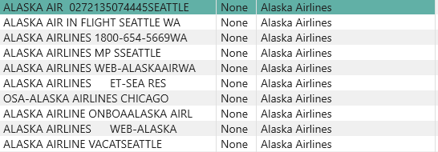
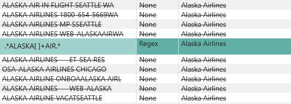

# Aliases

When you rename a payee and select the "**Auto-Rename** " checkbox in the Payee Rename dialog, then
you are creating an "**Alias** " for that Payee.  Aliases are important for
[Auto-Categorization](AutoCategorization.md) to work nicely.  Aliases make it possible for newly
downloaded transactions to automatically pick up the nice name you prefer for a given Payee.

You can manage all your Aliases using the **View/Aliases**  menu item:


If you delete a row from this list, it will not "undo" the rename, it will simply remove the alias
so that future auto-renames no longer take place.

When you accumulate a lot of renames for a given Payee you might want to use the [Regular
Expression](https://docs.microsoft.com/en-us/dotnet/standard/base-types/regular-expression-language-quick-reference)
feature to consolidate them.  For example, these are all the variations of Alaska Airlines one could
accumulate over the years:



You can change the `Name` of the first one here to the following pattern:

```
.*ALASKA[ ]+AIR.*
```
And change the `Type` column to `Regex`, then you will see the following consolidation take place:



The pattern means:
- `.*` any initial sequence of chars
- `ALASKA` the literal string must match
- `[ ]+` one or more space chars
- `AIR` the literal string
- `.*` any trailing sequence of chars

So this pattern matches all the other aliases we had created and therefore it will subsume then when
you `Save` the updated database, and it will match any future name you receive that matches this
pattern, making the [Auto-Categorization](AutoCategorization.md) feature work even better.


See also [Payees](Payees.md).


