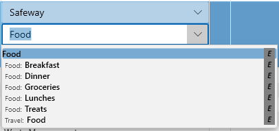
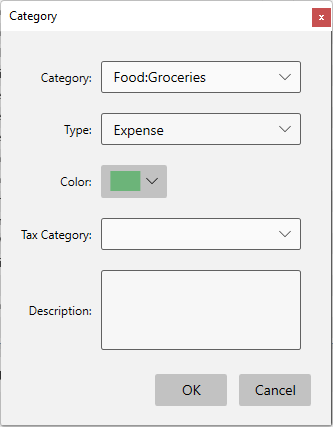
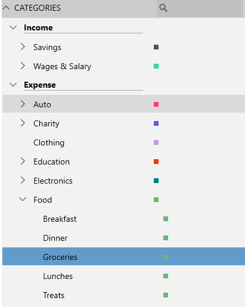
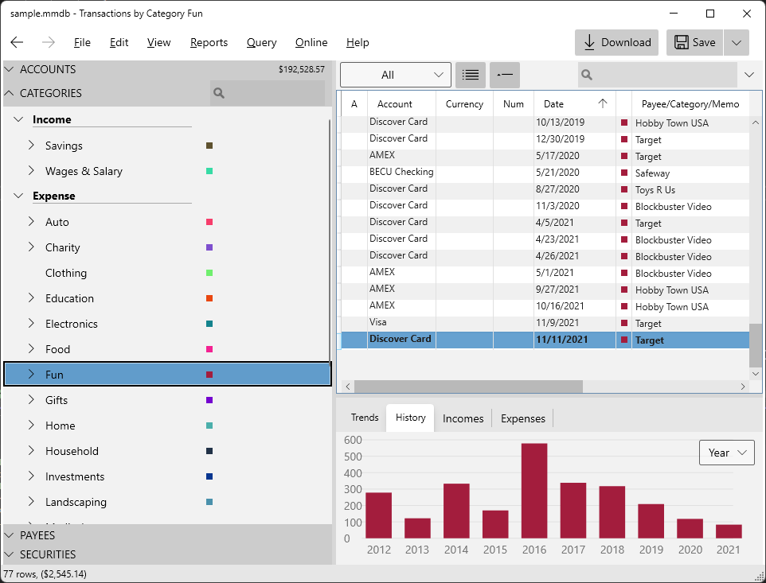
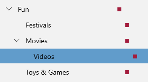
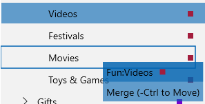

# Categories

Entering new categories is easy, simply type in the category name you want.  For example, I might enter "Food:Groceries" for this QFC item:

The colon (:) separator denotes a sub-category, so I'm saying I want "**Groceries** " to be a sub-category of the top level "**Food** " category.   You can define any top level categories and sub-categories that you want, you can even have sub-sub categories if you really need them.

The drop down is automatically filtered to show you matching categories and you can just type in any new category you want here and it will add a new category for you. 

When you enter a new category that has not been seen before the following dialog will appear:

Most of these fields are optional, except the name and Type.  The Tax Category field is used by the [Tax Report](../Reports/TaxReport.md) and is important if you want to export tax information to Turbo Tax.

When you select the "CATEGORIES" panel on the left you will see all your categories in a Tree view where you can manage them (add, delete, rename, merge, etc).

When you select a category from this Categories Panel it will instantly show you all transactions that are assigned that category together with a [chart of historical](../Charts/HistoryChart.md) spending :

You can also get to this view from any transaction using Right Click "View By Category".  Once you are in this view you can also select a transaction and get back to the account that transaction belongs in using "View By Account" or the back button.

The Categories Panel provides the following context menu items:

**Properties**  brings up the categories dialog for the selected category.

**Add New Category**  allows you to add a new top level or sub category which will then be inserted in the right place in the tree.

**Rename**  allows you to edit the category name, but won't let you specify an existing name here.  If you want to "merge" two categories use Drag/Drop - see below.

**Delete**  will pop up the rename category dialog if you have transactions using this category so that you can redirect those transactions to some other category.

You can also Drag/Drop a category anywhere in this list to change it's parent category.

**Reorganizing using Drag/Drop**
You can drag one category and drop it on another to merge or move a category in the hierarchy.  For example, You could move the category "Videos" by dragging it up to Movies and dropping it.

When I do that  it will become a new child under Movies:

If instead you hold the Control key while you drag you will see a different message showing that this will be a merge operation:

When the "Merge" is complete all transactions that used "Fun:Videos" will now have the category "Fun:Movies" so you have one less subcategory under Fun:

See also [Auto Categorization](AutoCategorization.md)

