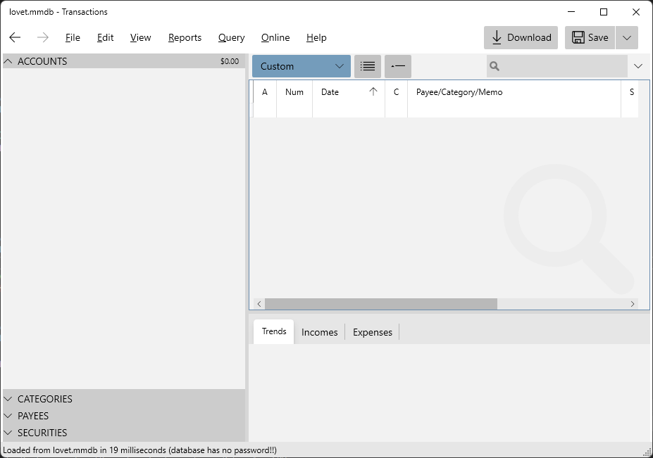

# Setup

When you first launch the app you will be greeted with a setup dialog where you can choose where to put your SQL lite database and a password to protect it.

Once you have completed your database setup you will be welcomed by the following screen. 

The first thing you will want to do is [create your accounts](../Accounts/SetupAccounts.md).

On the left you see four expandable panels for managing [Bank Accounts](../Accounts/BankAccounts.md), [Categories](Categories.md), [Payees](Payees.md) and [Securities](Securities.md).  In the main area on the right will be your banking transactions, and the bottom tabbed section will contain various [charts](../Charts/Charts.md) and download status information. 

If you just want to play with the app to get a feel for it you can populate your new database with [Sample Data](SampleData.md).

## Security

**SQL Lite**   stores your data in single file with name ending in *.mmdb.  The file is portable so you can move it with you or store it on a folder that gets synchronized across your machines automatically.  It is strongly recommended that you also provide password to encrypt the file so if anyone steals the file they will not be able to read what is in it.

The following shows an example of what you see inside of an encrypted SQL lite database:

    7e 88 c6 85 95 8d 3e 05 c7 af c9 28 bd 82 e1 a0 ~.....>....(....
    e7 0e 48 90 70 31 c4 b7 db d7 68 fb e3 86 33 29 ..H.p1....h...3)
    59 8d ed d5 97 16 cb 20 24 48 b3 b3 2e b1 0e 68 Y...... $H.....h
    ef 2f 05 47 16 d1 52 1b 00 0e e7 b2 ce ac ac 4b ./.G..R........K
    e6 8b b9 f9 06 fa bd 1b c4 73 92 35 10 39 a2 1c .........s.5.9..
    33 a2 b7 3b 5c 4c bc de 08 e2 1b 44 8e 9d c3 97 3..;\L.....D....
    39 95 12 e2 96 fa c2 28 62 6e 51 ab aa c3 1f d9 9......(bnQ.....
    93 d1 24 f8 ca 7e 6d 81 eb 74 e5 44 36 9c 4c 3a ..$..~m..t.D6.L:

As you can see the encryption makes it impossible to read, so your data is secure.

If you are opening an existing database using File.Open then you need to ensure you provide the correct password, otherwise you might see an error message like this, which is the result of a failed decryption.  This is what a hacker will see :-)

You can change the password using the View "[Options](Options.md)" menu item.

To open a password protected file on another machine you must provide the same password that was used to save it.  The password is saved in your local Windows Credential Store so you don't have to keep typing it in.  But this convenience could also help you forget the password.  If you open your Windows Credential Manager you will see an entry with a name starting with "MyMoney".

Be sure to backup your password in your favorite Password Manager
because if you forget it MyMoney provides no way to recover it.
