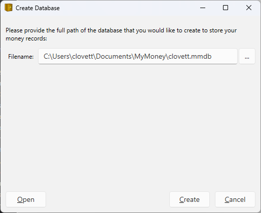
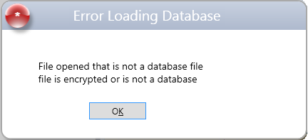

# Setup

When you first launch the app you will be greeted with a setup dialog where you can choose where to put your money database.

You should choose a folder that is otherwise empty because MyMoney.Net will create some more
folders inside the location you choose to store [Attachments](Attachments.md),
[Statements](../Accounts/Statemnents.md), [Online Banking](./Accounts/OnlineBanking.md) Logs, and optional
[StockQuotes](../Accounts/StockQuoteServices.md).  If you move the database, you will want to
move all this together and maintain the same folder hierarchy.

The ellipsis button to the right of the filename allows you to choose an existing database and optionally change the file type from SqlLite (*.mmdb) to one of the following:

The XML and Binary XML options are experimental and have not been fully tested.

The database file is portable so you can move it using USB storage device, or store it on a folder that gets synchronized across your machines automatically. 

## Security

MyMoney.NET on .NET 8.0 does not support adding a password to your **SQL Lite** databases, but you
can set a password on the **Binary XML** files. This password is also saved in your local Windows
Credential Store so you don't have to keep typing it in.  But this convenience could also help you
forget the password.  If you open your Windows Credential Manager you will see an entry with a name
starting with "MyMoney".

Be sure to backup your password in your favorite Password Manager because if you forget it MyMoney
provides no way to recover it.

## Welcome

Once you have completed your database setup you will be welcomed by the following screen. 

The first thing you will want to do is [create your accounts](../Accounts/SetupAccounts.md).

On the left you see four expandable panels for managing [Bank Accounts](../Accounts/BankAccounts.md), [Categories](Categories.md), [Payees](Payees.md) and [Securities](Securities.md).  In the main area on the right will be your banking transactions, and the bottom tabbed section will contain various [charts](../Charts/index.md) and download status information. 

If you just want to play with the app to get a feel for it you can populate your new database with [Sample Data](SampleData.md).

## Troubleshooting

If you are opening an existing database using File.Open that had a password from an older version
of MyMoney.Net you might see an error message like this, which is the result of a failed decryption. 

The new .NET 8.0 version of MyMoney.Net does not support passwords.  This means if you are upgrading
to this new version you have to first remove the password from your database, then do the upgrade.
If you forgot to do that then you can install this
[old version using winget](https://winget.run/pkg/LovettSoftware/MyMoney.Net) that does work with a password, remove the password, then re-install the new version.

You can remove the password using the View "[Options](Options.md)" menu item, clear the password,
then hit Save.
